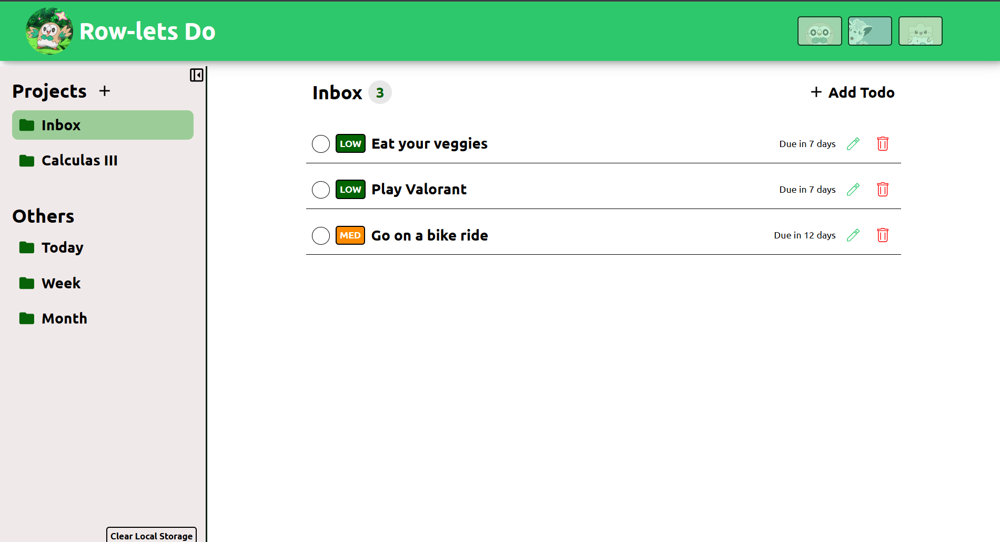
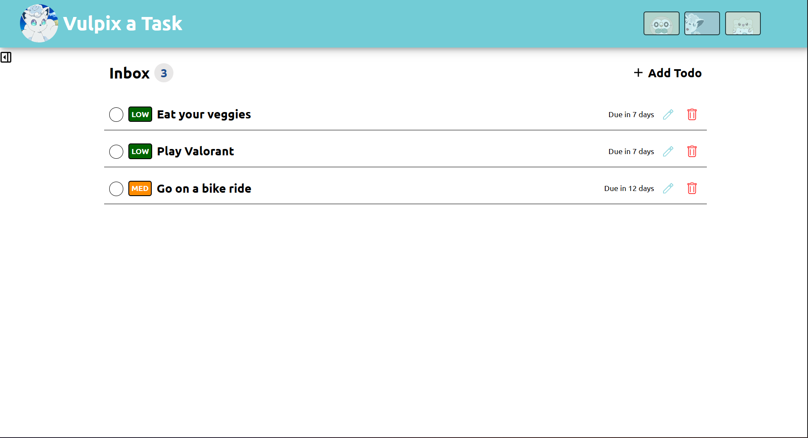
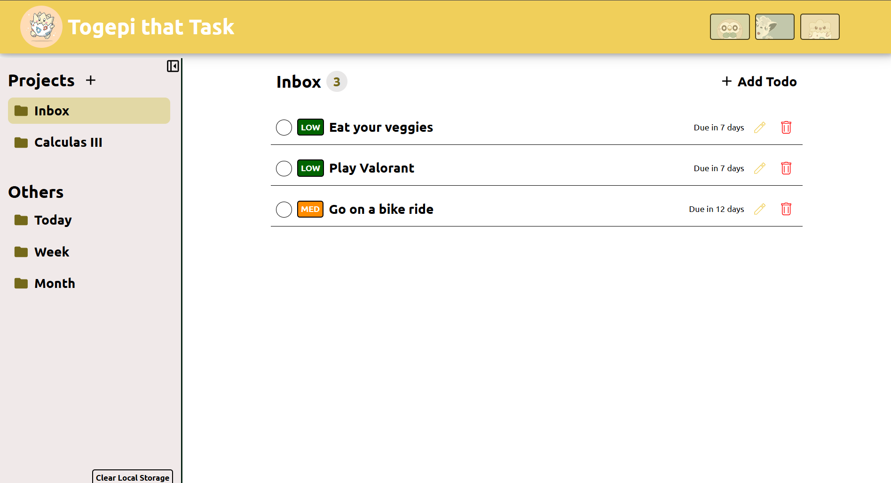
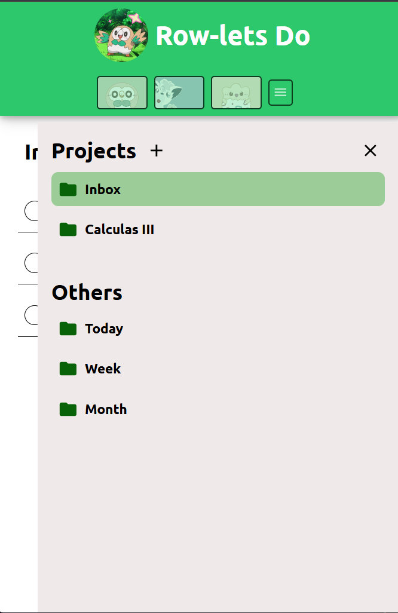

# Row-lets Do

A pokemon inspired todo list application with prioritiy levels, project tabs, and due dates built with vanilla JavaScript.

## Features
* ✅ Task Management - Create, edit, save and delete todos
* 📁 Project Organization - Group todos into custom projects
* 🎯 Priority Levels - Give tasks priority levels (easy, med, and hard)
* 💾 Local Storage - user created projects and todos will persist in the browser
* 📱 Responsive Design - Works seamlessly on desktop and mobile devices

[Live App](https://andykhandy.github.io/todo_list/)

## Pictures 

## Future ideas to implement
* Ability to send reminders of nearing due dates
* Mark past due dates as uncompleted
